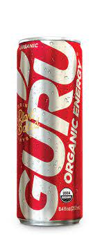

# CybersecurityClass
---
## Why ~~bang~~Guru is the best Energy Drink

| Guru | Bang |
|------|------|
| It doesn't use any Artificial Sweetners | Uses Artificial Sweetners |
| It uses All Organic Ingredients | Uses Lots of Chemicals |
| Sparkling Water, Organic Cane Syrup, Organic White Grape Juice Concentrate, Natural Flavors, Apple Acid, Citric Acid, Organic Green Tea Leaf Extract, Organic Guarana Seed Extract, Organic Echinacea Flower Extract, Organic Panax Ginseng Root Extract. |Carbonated Water, Citric Acid Anhydrous, Malic Acid, Natural and Artificial Flavors, Caffeine Anhydrous, Sodium Benzoate (Preserves Freshness), Potassium Citrate Monohydrate, Sucralose, L-Leucine, Potassium Phosphate Dibasic, Vitamin C (Ascorbic Acid), Calcium Chloride, Acesulfame Potassium, Potassium  |
|||
	

